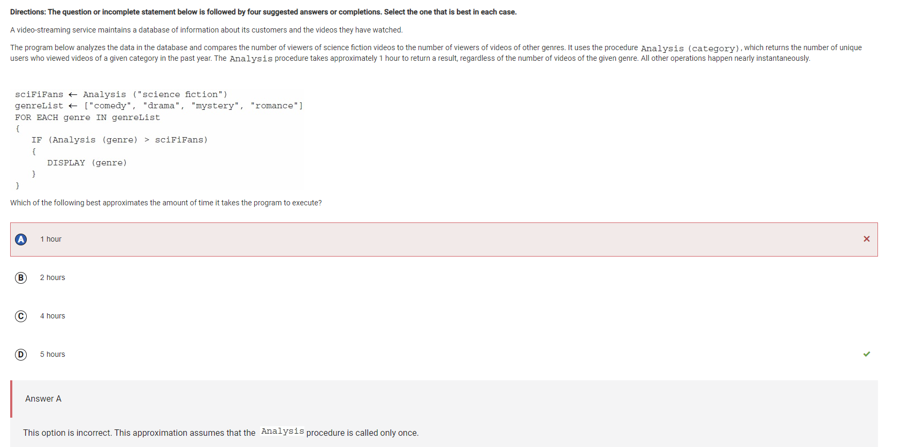
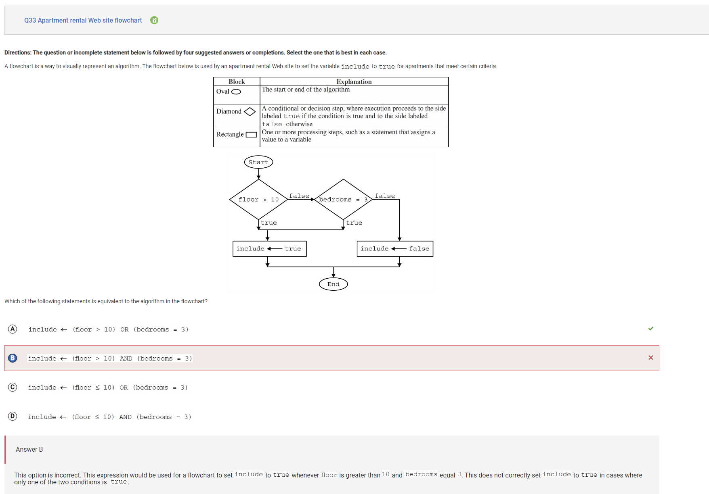
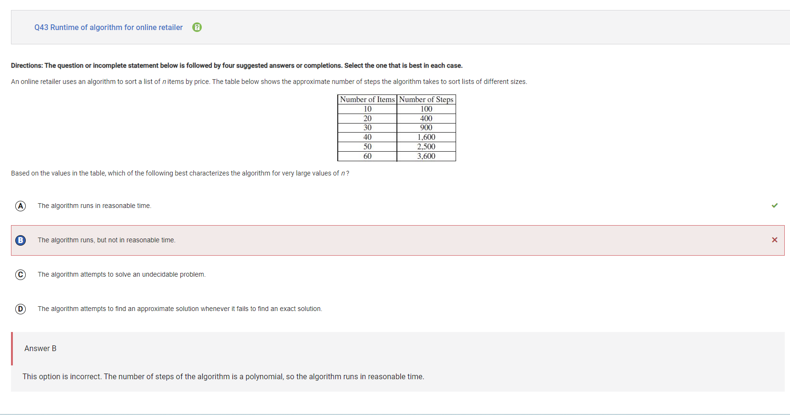
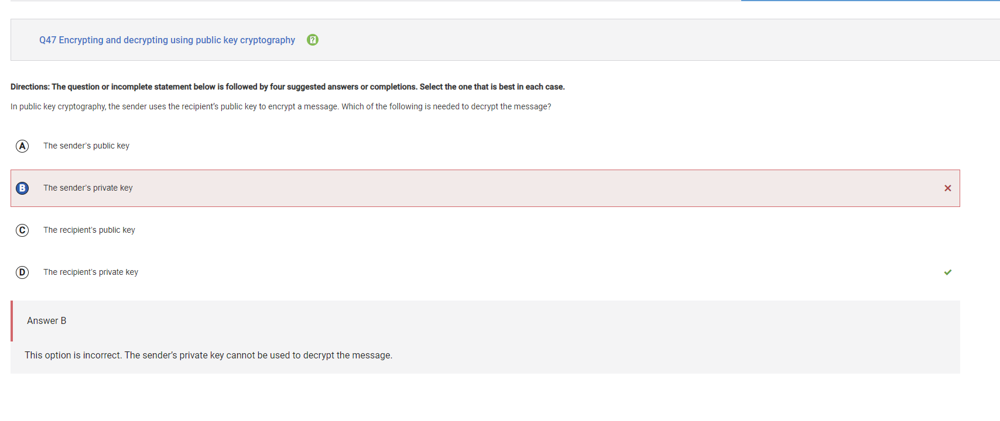
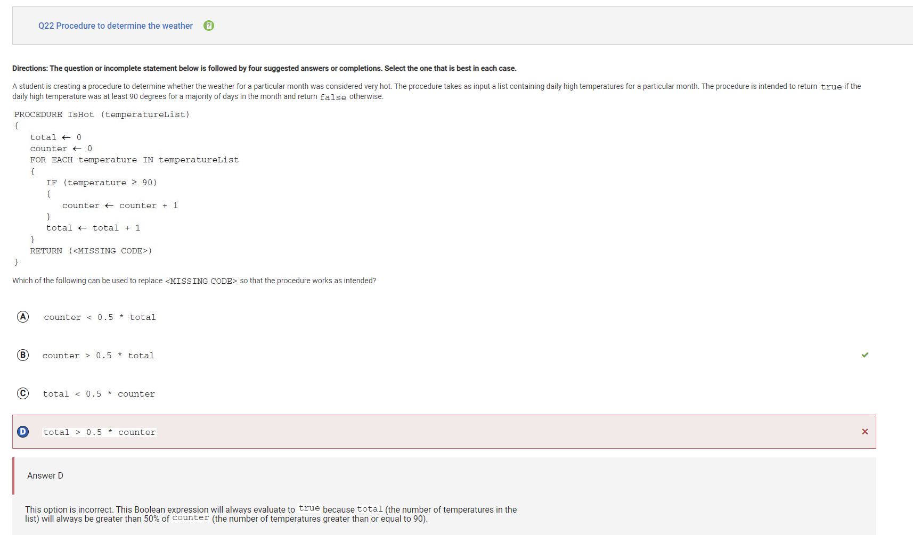
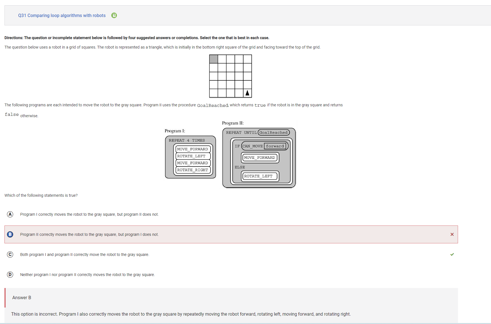
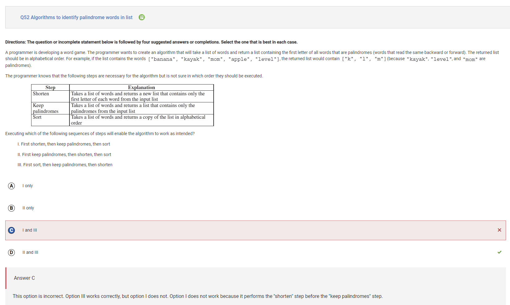
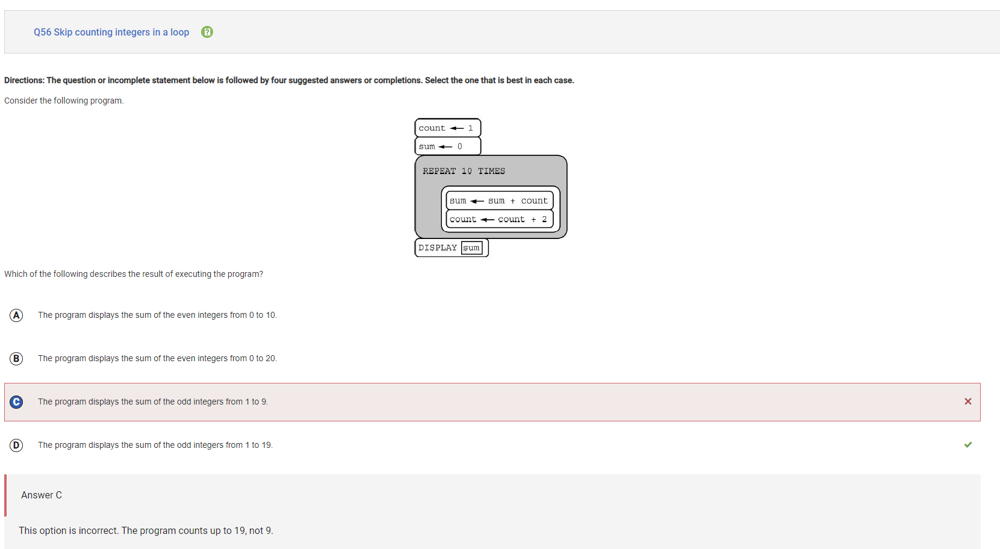
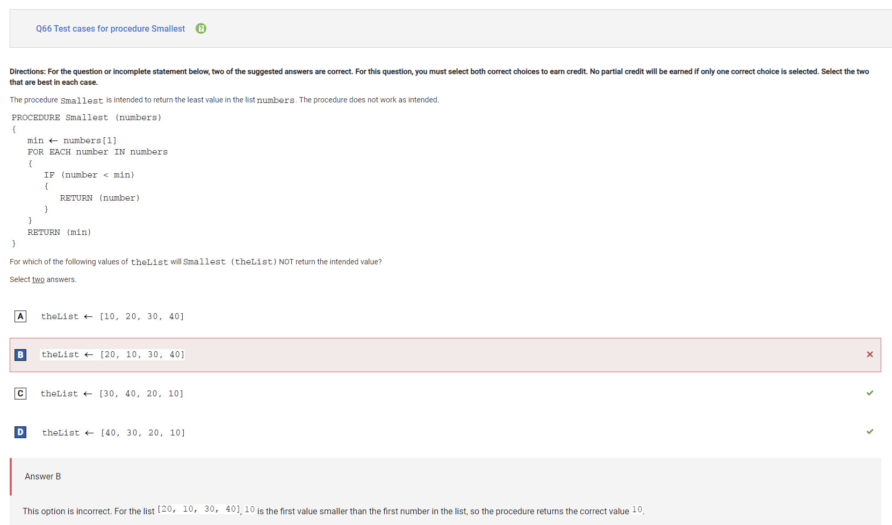

- Over the course of this project, I got a lot of opportunities to grow as a coder. I'm happy to say that I have been able to work with both front and backend which has increased my knowledge of the class. Here are some issues I ran into:
    - Image to base64 code: <a href="https://github.com/BearytheGreenBear/fte-frontend/issues/1">Issue</a>
    - Downloading blank image bug (No issue unfortunately)
    - Backend image history: <a href="https://github.com/trevorhuang1/fte-backend/issues/2">Issue</a>
    - Displaying the history: <a href="https://github.com/BearytheGreenBear/fte-frontend/issues/2">Issue</a>
    - Clearing the history: <a href="https://github.com/BearytheGreenBear/fte-frontend/issues/4">Issue</a>

## Image to base64 writeup:
- <a href="https://github.com/BearytheGreenBear/fte-frontend/commit/3146f6c43027609077f403b2714d0ede078078b3">Link to the commit</a>
- This was my first big contribution to the project. My biggest struggle was probably just my lack of overall knowledge on how to do it
- This is the code that I made
```
<script>
    //getting the image inputted by user
    const image = document.getElementById("imageInput");
    //add event listener for when image is uploaded and declare function on the spot
    image.addEventListener("change", function(){
        //taking the first part of object FileList
        const file = image.files[0];
        //creates new instance of the FileReader object
        var reader = new FileReader;

        //listens for when the file is fully read
        reader.addEventListener("load", function() {
            console.log(reader.result);
        })

        //initiates the reading process and reads the file as a data URL
        reader.readAsDataURL(file);
});
</script>
```

- A minor error that I got was as shown:
```
Uncaught TypeError: Failed to execute 'readAsDataURL' on 'FileReader': parameter 1 is not of type 'Blob'.
    at HTMLButtonElement.handleImageUpload
```
- The problem was actually that I used image.files instead of image.files[0]. I learned that image.files is actually an object of all the properties of the image and I only wanted the first part.

### Summary:
- Overall, the image to base64 code that I worked on significantly improved my coding skills and gave me some of the javascript experience I would need for future frontend code.

## Downloading blank image bug:
- <a href="https://github.com/BearytheGreenBear/fte-frontend/commit/5230806549dbd133f6d2eee688eba7b70fa1aee7">Link to the commit</a>
- This was a really simple issue that for some reason caused my group a lot of anguish. Funnily enough, I was able to solve it in 3 lines of code.

We thought that the following line in the code already solved the issue:
```
if (file) {
    const reader = new FileReader();
```

```
if (uploadedImage.width == 0) {
    //sends alert
    alert('Please upload an image before trying to download');
        return;
}
```

### Summary
- I wanted to highlight this issue because in this moment I realized that creating a sound solution doesn't need to complicated. It just needs to work

## Backend history:
<a href="https://github.com/trevorhuang1/fte-backend/commit/83f69017773235a9337201ec92ad5578c4c53ad7">Link to the commit</a>
- This is a project that our entire group worked over a call
- We encountered basically no errors besides typos, but the experience helped us become better collaborators
- For instance, take a look at the whiteboard we made

### Summary:
- This one part of our project really helped us become better communicaters and teammates in general. 

## Displaying the history
<a href="https://github.com/BearytheGreenBear/fte-frontend/commit/1fec30547c09b410430979c0fb3673421c01a5c4">Link to the commit</a>
- This was one of my biggest contributions to the team and definitely what I'm most proud of

This is the code that I made using Mr. Mortensen's example:
```
<script>
    //setting up url
    const apiUrl = "http://localhost:8017/api/pixel-partner-api/get_database";
    let images = [];
    //fetches data from the url
    function fetchDatabase() {
        fetch(apiUrl)
        //parsing as json
        .then(response => response.json())
        .then(response => {
            images = response;
            //gets the table id
            table = document.getElementById(imageTables);
            //loops through and fills in the table
            images.forEach(entry => {
                const row = table.insertRow();
                const nameCell = row.insertCell(0); 
                const functionCell = row.insertCell(1); 
                const imageCell = row.insertCell(2);

                nameCell.innerHTML = entry.name;
                functionCell.innerHTML = entry.function;
                imageCell = entry.image;
            })
        })
    }
</script>

<h2>Image upload history:</h2>
<table id="imageTables">
    <tr>
        <th>Name</th>
        <th>Function</th>
        <th>Image</th>
    </tr>
</table>
```

- Ian and Mr. Lopez helped me a lot in fixing issues. You can see all the errors I encountered on the issue I made

Most recent code (we are currently working on this)
```
<script>
    //setting up url
    // const apiUrl = "http://localhost:8017/api/pixel-partner-api/get_database";
    const apiUrl = "https://fte.stu.nighthawkcodingsociety.com/api/pixel-partner-api/get_database";
    let images = [];
    //fetches data from the url
    function fetchDatabase() {
        fetch(apiUrl)
        //parsing as json
        .then(response => response.json())
        .then(response => {
            var images = JSON.parse(response).reverse();
            console.log(images)
            //gets the table id
            var table = document.getElementById("imageTables");
            //loops through and fills in the table
            for(var element of images){
                var row = table.insertRow();
                var nameCell = row.insertCell(0); 
                var functionCell = row.insertCell(1); 
                var imageCell = row.insertCell(2);

                nameCell.innerHTML = element.name;
                functionCell.innerHTML = element.func;

                const fileExtension = element.name.split('.').pop();

                var Imagecell = new Image();
                Imagecell.src = 'data:image/' + fileExtension + ';base64,' + element.image;
                imageCell.appendChild(Imagecell)

                console.log(element);
            }
        })
    }
    //calls function to fetch database
    fetchDatabase();
</script>

<h2>Image upload history:</h2>
<table id="imageTables">
    <tr>
        <th>Name</th>
        <th>Function</th>
        <th>Image</th>
    </tr>
</table>
```

## Clearing the image history
<a href="https://github.com/BearytheGreenBear/fte-frontend/commit/bfb5ceb454595735b449cb89a59d2c0f25dc48ac">Link to frontend commit</a>
<a href="https://github.com/trevorhuang1/fte-backend/commit/2d5a3a0f19e62e78f020a443e767037217903b6d">Link to backend commit</a>

- This required me to use both the frontend and backend knowledge to clear the image history displayed on the website

```
# Initialize DB
def initializeDatabase():
    # Global so all functions can use
    global engine, Session, session

    # Create a database connection and session
    engine = create_engine('sqlite:///database2.db')
    Session = sessionmaker(bind=engine)
    session = Session()

    # Create the database table
    Base.metadata.create_all(engine)

def clearDatabase():
    initializeDatabase()
    session.query(Images).delete()
    session.commit()
    session.close()

class _ClearDatabase(Resource):
    def get(self):
        clearDatabase()

api.add_resource(_ClearDatabase, '/clear_database')
```

- I had to create a new function which initializes the database, deletes all the images, commits, and then closes so it full deletes all images
- I was involved with our groups other backend functions such as the the getHistory function so this wasn't too hard for me

```
<button onclick="clearDatabase()">Clear Image History</button>
<button onclick="refreshPage()">Refresh Database</button>

    function clearDatabase() {
        fetch(apiUrl2, {method: 'GET'})
        .catch(err => {
            error(err + " " + response.status);
            });
    }
    function refreshPage() {
        window.location.reload();
    }
```
- I needed to use what I knew about fetching to use a GET request from the backend to clear the database. I wasn't to sure on how to do this so I asked my teammates to fill me in.
- I learned a lot about fetching and the difference between GET requests and POST requests

### Summary:
- This experience helped me use both my frontend and backend knowledge that I had accumalated throughout this project and I'm satisfied with the result. It clears the website history effectively.

## Our team teach
- For our team teach, I worked on the content for relational operators, and gates, and or gates. This was mostly just review for me and most of my learning of booleans and logic gates came as a result of when we reviewed the entirely file as a group.

## Other team teaches

## College Board Quiz

I got a score of 57/66 on the College Board quiz, so there's certainly a lot of mistakes that I could touch on. For the sake of time, I want to only review the questions that I missed the concept instead of just silly mistakes.



Question 30:
- I said it would take 1 hour, but that is incorrect. The analysis procedure takes 1 hour every time it is called and it is called 1 time outside the loop and 4 times within so it would take 5 hours.




Question 33:
- My mistake was that I misread the graph. Includes is true if either floors > 10 OR bedrooms = 3 so it should be option A



Question 43:
- The amount of steps is actually number of items squared, so the program would actually run in a reasonable amount of time as long as the number of items isn't too high (I said it would run in a unreasonable time)



Question 47:
- The problem was that I didn't understand cryptography. I said that they would need the sender's private key, but thats not true for public key cryptrography. Instead the message is sent with the user's public key and received with the receipients private key

The rest of the corrections are about non conceptual mistakes 



Question 22:
- I accidently mixed up total and count. Total is the total number of days in that month, and count is the total number of hot days in that month. The correct answer would be if counter > 0.5 total because that means that over half the days that month were over 90 degrees



Question 31:
- I didn't realize that the first program gets to the gray box diagnally, so both are correct.



Queston 52:
- I actually got the question right but I guess I just misclicked. Option 1 is correct because you cannot find the palindromes if they are all just a single letter when shortened



Question 56:
- For this question I recognized that it was only finding odd numbers but didn't remember the fact that it is +2 ten times, so it would display 1-19 not 1-9.



Question 66:
- I sort of just jumped into the problem without thinking much. The program is considering the first value of the list as the minimum and the next value that is lower is the new minimum. This doesn't take into account the fact that the lists are not in order, so C and D return values that are smaller than the true minimum of the list

Extra Credit:
- <a href="https://github.com/Cosmic-Carnage/Issues/issues/33">First group</a>
- <a href="https://github.com/monke7769/passion/issues/6">Second group</a>
- <a href="https://github.com/JoshThinh/Asian-United-Frontend/issues/1">Third Group</a>

## Reflection
I came into this class with little to no coding experience. At first, it felt like I was trapped in a maze with no idea of how to get out. However as the weeks rolled by, I started to navigate through this maze with the aid of my teachers, classmates, and friends and my knowledge slowly started to grow. Over the past almost 12 weeks, I've found myself starting to get over the learning curve and make my way though this maze. Now that I'm approaching the end, I know that there will be more challenges in the next trimester of this class, but I am ready to tackle them as a stronger, more resilient person than I was this summer. This experience has been super rewarding for me and I can only thank the people who have supported me throughout this journey. I feel nothing but anticipation and excitement for the next trimester of this class, and I hope that I can finish this year as a fully fledged coder ready to take on CSA.
