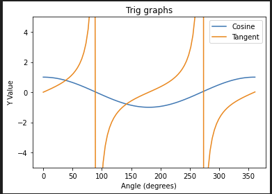

<h1>3.14 Libraries</h1>
A file that contains procedures that can be used in a program is called a library. An Application Program Interface, or API, contains specifications for how the procedures in a library behave and can be used. It allows the imported procedures from the library to interact with the rest of your code.
<h2>Types of Libraries</h2>
There are many types of libraries that modern day companies use, such as Requests, Pillow, Pandas, NumPy, SciKit-Learn, TensorFlow, and Matplotlib. Requests: The Requests library simplifies making HTTP requests in Python, making it easy to interact with web services and retrieve data from websites.

Pandas: Pandas is a data manipulation and analysis library for efficiently working with structured data, including data import, cleaning, transformation, and analysis in tabular form.

Scikit-Learn: Scikit-Learn is a machine learning library that offers simple and efficient tools for data analysis and modeling, including classification, regression, and clustering.

TensorFlow: TensorFlow is an open-source machine learning framework that facilitates deep learning and neural network development, supporting tasks like image recognition and natural language processing.

Matplotlib: Matplotlib is a versatile plotting library for creating 2D and 3D visualizations and figures in Python, enabling a wide range of plots, charts, and graphs for data visualization and analysis. 

Libraries are, at their heart, a collection of other people's code, and it would be difficult to understand how the procedures should be used without documentation. APIs explain how two separate pieces of software interact with each other, and they also need documentation to keep this communication going.  


<h2>Popcorn Hack 1</h2>
We have now hopefully all done or seen this type of question about getting a robot from point a to point b. But this can be very tedious because it may take a lot of code to do that. Luckily, there’s a saving grace called procedures, procedures essentially shorten the amount of code that is needed. So for a robot example we have displayed, we will use the procedure “moveBackwards” to shorten the amount of code we would normally need. This will rotate our triangle 180 degrees. Here is the example and solution


```python
#Code goes here
moveBackwards
moveForward
ROTATE_RIGHT
MoveForward
MoveForward
```

Pillow: Pillow is a powerful image processing library for opening, manipulating, and saving various image formats in Python.


```python
from PIL import Image

# Example usage:
image = Image.open('/home/lincolnc2008/vscode/student3/images/frog-game.jpg')#This is the path of the image
image.show()
```


    ---------------------------------------------------------------------------

    FileNotFoundError                         Traceback (most recent call last)

    /tmp/ipykernel_1212/2089074910.py in <module>
          2 
          3 # Example usage:
    ----> 4 image = Image.open('/home/lincolnc2008/vscode/student3/images/frog-game.jpg')#This is the path of the image
          5 image.show()


    /usr/lib/python3/dist-packages/PIL/Image.py in open(fp, mode, formats)
       2951 
       2952     if filename:
    -> 2953         fp = builtins.open(filename, "rb")
       2954         exclusive_fp = True
       2955 


    FileNotFoundError: [Errno 2] No such file or directory: '/home/lincolnc2008/vscode/student3/images/frog-game.jpg'


from PIL import Image:

This line imports the Image module from the PIL library. PIL stands for Python Imaging Library, which is used for opening, manipulating, and saving image files.

image = Image.open('/home/lincolnc2008/vscode/student3/images/frog-game.jpg'):

This line opens an image file named '/home/lincolnc2008/vscode/student3/images/frog-game.jpg' using the Image.open() method. It creates an Image object and assigns it to the variable image.

image.show():

This line displays the image using the show() method. This will open the default image viewer on your system and display the image.

### Popcorn Hack 2
Do this same thing but with a different image. Make it personallized!


```python
# Code goes here
from PIL import Image
image = Image.open("/home/trevor/vscode/csp_blog/_notebooks/image/Flowchart.png")
image.show()
```


    

    


NumPy: NumPy is a fundamental library for numerical computing in Python, providing support for multidimensional arrays and a wide range of mathematical functions.


```python
import numpy as np

# Example usage:
arr = np.array([1, 2, 3, 4, 5])
print(arr)
```

    [1 2 3 4 5]


import numpy as np:

This line imports the Numpy library with the alias np. Numpy is a powerful library in Python for numerical computations, particularly with arrays and matrices.

arr = np.array([1, 2, 3, 4, 5]):

This line creates a Numpy array named arr using the np.array() function. The array is initialized with the values [1, 2, 3, 4, 5].

print(arr):

This line prints the array arr to the console

## Popcorn Hack 3
You are given two 1-dimensional Numpy arrays, A and B, of the same length. Perform the following element-wise operations and return the results:

Add each element of array A to the corresponding element of array B.
Multiply each element of array A by the corresponding element of array B.
Square each element of array A.


```python
# Code goes here
import numpy as np

a = np.array([1, 2, 3, 4])
b = np.array([5, 6, 7, 8])

def operations(a, b):
    add = np.add(a, b)
    multiply = np.multiply(a, b)
    square = np.multiply(a,a)
    
    print("Addition: ", add)
    print("Multiply: ",multiply)
    print("Square: ",square)
    return add, multiply, square

operations(a, b)
```

    Addition:  [ 6  8 10 12]
    Multiply:  [ 5 12 21 32]
    Square:  [ 1  4  9 16]


    (array([ 6,  8, 10, 12]), array([ 5, 12, 21, 32]), array([ 1,  4,  9, 16]))


```python
import matplotlib.pyplot as plt

# Example usage:
x = np.linspace(0, 10, 100)
y = np.sin(x)
plt.plot(x, y)
plt.show()
```


    

    


import matplotlib.pyplot as plt:

This line imports the pyplot module from the Matplotlib library with the alias plt. Matplotlib is a powerful library in Python for creating visualizations and plots.

x = np.linspace(0, 10, 100)
y = np.sin(x):

These lines create two Numpy arrays x and y. x is generated using np.linspace() which creates an array of 100 equally spaced points between 0 and 10. y is generated by taking the sine of each element in x.

plt.plot(x, y):

This line creates a line plot using the plot() function from Matplotlib. It takes x and y as the data for the x and y coordinates of the plot.

plt.show():

This line displays the plot using the show() function. It opens a window with the generated plot.

## Popcorn Hack 4
You have a dataset representing the monthly sales of a company over a year. The data is provided as two lists: months (containing the names of the months) and sales (containing the corresponding sales figures).

Your task is to create a bar chart to visualize the monthly sales.

Write a Python function that takes the lists months and sales as input and generates a bar chart using Matplotlib. The function should also label the x-axis with the months and the y-axis with "Sales (in thousands)".


```python
# Code goes here
import matplotlib.pyplot as plt

months = ['Jan', 'Feb', 'Mar', 'Apr', 'May', 'Jun', 'Jul', 'Aug', 'Sep', 'Oct', 'Nov', 'Dec']
sales = [150, 170, 190, 200, 220, 250, 280, 300, 280, 250, 230, 190]

def bar_chart(months, sales):
    plt.bar(months, sales)
    plt.xlabel("Months")
    plt.ylabel("Sales (in thousands)")
    plt.show()
    
bar_chart(months, sales)
```


    

    


<h1>Optional Popcorn Hack</h1>
Now for extra credit, create a program(s) using all the libraries we provided (Pillow, NumPy, TensorFlow, etc). Try showing a basic understanding of how to use each one of these libraries. Try doing something fun or creative!


```python
# Code goes here
```

<h1>Homework!</h1>
For our homework hack, Write a Python program that uses the NumPy library to generate an array of values for the sine and cosine functions over a specified range, and then use Matplotlib to create a plot that shows both functions on the same graph. The program should:
Import the necessary libraries (NumPy and Matplotlib).
Define a range of angles in degrees, e.g., from 0 to 360 degrees.
Use NumPy to calculate the sine and cosine values for each angle in the range.
Create a Matplotlib plot with the angles on the x-axis and the sine and cosine values on the y-axis.
Label the plot with appropriate titles, axis labels, and a legend.
Display the plot on the screen.


```python
import numpy as np
import matplotlib.pyplot as plt

def trig():
    pick = input("Which function would you like to display? (sin, cos, or tan)")
    pick2 = input("Choose a second function (sin, cos, tan)")
    degrees = np.linspace(0, 361, 100)
    radians = np.radians(degrees)
    sin_values = np.sin(radians)
    cos_values = np.cos(radians)
    tan_values = np.tan(radians)
    
    if pick == "sin":
        plt.plot(degrees, sin_values, label="Sine")
    if pick == "cos":
        plt.plot(degrees, cos_values, label="Cosine")
    if pick == "tan":
        plt.plot(degrees, tan_values, label="Tangent")
    
    if pick2 == "sin":
        plt.plot(degrees, sin_values, label="Sine")
    if pick2 == "cos":
        plt.plot(degrees, cos_values, label="Cosine")
    if pick2 == "tan":
        plt.plot(degrees, tan_values, label="Tangent")
    
    plt.ylim(-5, 5)
    
    plt.title("Trig graphs")
    plt.xlabel("Angle (degrees)")
    plt.ylabel("Y Value")
    plt.legend()
    plt.show()

trig()

```


    

    


It was not displaying the image and I tried screenshotting and it still did not work. Please check slack.



<h1>Thank You!</h1>
